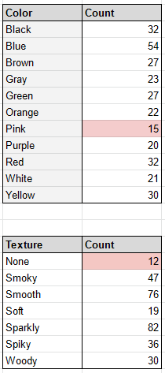
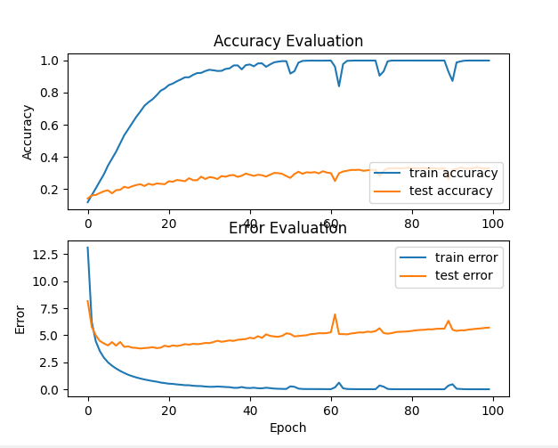
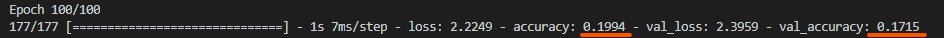
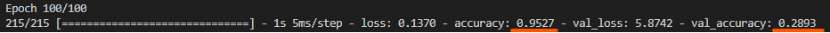

# Testing 
### Testing Plan:
Tests will be roughly outlined at the very beginning of the project (in compliance with the V-model chosen), but will be flushed out as the process
continues. Testing will be done after each major step to ensure that an application isn't being built using an in-accurate model. As state in the
Product Requirements Document (PRD), "If the AI does not meet the accuracy goal, the application to visualize the AI's predictions will not be made 
(as it would be predicting incorrectly). Instead, time will be put into researching reasons the accuracy goal was not met."

## Unit Testing
- Distribution of music type (300 songs across 20 genres)
- Sufficient Representation of categories (15 songs per color/ texture)
- Length of samples (30 seconds)
    
  ### Test 1: Distribution of Music
  | Test ID | UT1: Music Distribution | 
  | --- | --- |
  | Time/Date | 02/27/2021 |
  | Requirements ID | FR 4.5.2.1 |
  | Environment | Google Sheets, YouTube |
  | Goal | To distribute the 300 song goal across various genres, as to not limit the AI to only pop music, classical music, etc. |
  | Procedure | Given 20 music genres, verify (Google Sheets) that there are at least 15 songs in each genre category |
  | Expected Results | 15 songs (minimum) in each of the 20 music genres, resulting in at least 300 songs | 
  | Actual Results | 11-30 songs in each category (11 for similar categories, such as modern rock, classic rock, etc. 30 songs for pop 2011-2020, where the genre covers a variety of sounds. Total of **305 songs** |
  | Status | SUCCESS |
      
  ### Test 2: Sufficient Representation of Categories

  | Test ID | UT2: Category Representation |
  | --- | --- |
  | Date | 03/11/2021 |
  | Requirements ID | FR 4.6.2.1 |
  | Environment | Google Sheets |
  | Goal | Each category (meaning each color and texture) has at least 15 songs representing it. |
  | Procedure | In Google Sheets, create a formula to count the instances of each color. Using conditional formatting, highlight if a category has less than 15 items. |
  | Expected Results | All categories have 15 songs (45 samples) or more |
  | Actual Results | 2 categories had less than 15 songs: Pink (Color), None (Texture) |
  | Status | FIXED - SUCCESS |
  | Images: |    |
      
    
    ### Test 3: Equal Sample Lengths
    
  | Test ID | UT3: Sample Length |
  | --- | --- |
  | Date | 03/16/2021 |
  | Requirements ID | - |
  | Environment | Windows Explorer, Adobe Premiere |
  | Goal | Verify that all samples are the same length (30 seconds) after cutting them in Adobe Premiere|
  | Procedure | In Windows Explorer, verify that the size is roughly 5,638 KB. If it is not, open it to verify that it is 30 seconds. |
  | Expected Results | All songs are 30 seconds long |
  | Actual Results | Found 7 samples that were not 30 seconds: 90pop12-3, na10-1, na10-2, so10-3, 20pop32-2, co11-2, co10-3 |
  | Status | FIXED - SUCCESS |
  | Images |      |
      
## Integration Testing

- Make sure all song samples are being read in and analyzed
      
    ### Test 4: Verify All Samples Being Read
  | Test ID | IT1: Reading Samples |
  | --- | --- |
  | Date | 03/23/2021 |
  | Requirements ID | FR 4.1.3.2 |
  | Environment | Visual Studio Code |
  | Goal | Output the count of samples read using extract_data.py. It should equal the number of songs (305) multiplied by 3. (915) |
  | Procedure | Create a count variable for the number of songs read into the extract_data.py file and print it out |
  | Expected Results | 915 samples |
  | Actual Results | 915 samples. All samples went through. |
  | Status | SUCCESS |

      
## Validation Testing

- Overfitting testing
- Accuracy test
- Confusion Matrix testing
      
    ### Test 5: Solve for Overfitting
  | Test ID | VT1: Overfitting |
  | --- | --- |
  | Date | 03/16/2021 |
  | Requirements ID | FR 4.2.3.1 |
  | Environment | Visual Studio Code, Matplotlib |
  | Goal | Identify and solve for overfitting |
  | Procedure | Create an accuracy evaluation using matplotlib. Tweak the model using dropout and regularization to solve for overfitting. Verify that it has been solved using a new matplotlib graph |
  | Expected Results | Graph shows overfitting before dropout and regularization. Train and test accuracy should be pretty close afterwards (preferably a high percentage)|
  | Actual Results | Results as expected, however the accuracy percentage was significantly lower than expected (18%) |
  | Status | SUCCESS: Proposes new problem |
  | Overfitted: |   |
  | Adjusted: |   |
      
    
    ### Test 6: Accuracy Test
    
  | Test ID | VT2: Accuracy|
  | --- | --- |
  | Date | 03/18/2021 |
  | Requirements ID | ONR 5.5 |
  | Environment | Visual Studio Code |
  | Goal | Primary Goal was to be above 50% accuracy |
  | Procedure | Tweak parameters in order to get as high of an accuracy score as possible. |
  | Expected Results | Above 50% |
  | Actual Results | Consistently around 18%. Highest Result of 24% |
  | Status | FAILED |
  | Images |       |
      
    
    ### Test 7: Confusion Matrix
    
  | Test ID | VT3: Confusion Matrix |
  | --- | --- |
  | Date | 03/24/2021 |
  | Requirements ID | FR 4.2.3.3 |
  | Environment | Visual Studio Code, sklearn |
  | Goal | Confusion Matrix with the diagonal more prominent |
  | Procedure | Using sklearn, plot the diagonal matrix of the correct and predicted labels. |
  | Expected Results | Prominent diagonal |
  | Actual Results | AI guessed the same answer a majority of the time. |
  | Status | FAILED: Proposes new problem |
  | Confusion Matrix |   |
      

  ### Test 8: Subject Testing
  
  | Test ID | VT4: Subject Testing |
  | ------- | -------------------- |
  | Date | 04/12/2021 |
  | Requirements ID | ONR 5.5 |
  | Environment | Google Sheets |
  | Goal | score of 50% or above |
  | Procedure | After gathering the reponses of 25 samples not included in the test/training data, the subject scored each response (out of 10: 0 being completely incorrect, 10 being completely correct) based on how well it replicated what her own synesthetic response was. |
  | Expected Results | Average response above 50% accurate (Primary goal) |
  | Status | SUCCESS: Average score of 51.2%

  #### Subject Testing Responses:
  | Song | Color | Texture | Lum. | Score (out of 10) | 
  | ---- | ----- | ------- | ---- | ----------------- |
  | blues56 | Woody | Gray | No | 6 |
  | blues 65 | Spiky | Pink | No | 0 | 
  | blues96 | Untextured | Gray | No | 8 |
  | classical13 | Soft | Orange | No | 8 |
  | classical47 | Sparkly | Black | No | 7 |
  | country77 | Smoky | White | Yes | 5 |
  | disco10 | Smooth | Green | No | 6 |
  | disco40 | Smoky | Blue | Yes | 8 |
  | hiphop36 | Soft | Brown | No | 1 |
  | hiphop49 | Sparkly | White | Yes | 3 | 
  | hiphop89 | Woody | Pink | No | 2 | 
  | jazz05 | Smoky | Pink | No | 4 |
  | jazz67 | Untextured | Yellow | Yes | 6 |
  | jazz78 | Smooth | Green | Yes | 4 |
  | metal12 | Woody | Yellow | No | 1 |
  | metal22 | Spiky | Black | No | 9 |
  | metal44 | Woody | Yellow | No | 8 |
  | metal96 | Sparkly | Red | Yes | 10 |
  | pop13 | Soft | Brown | Yes | 7 |
  | pop39 | Smooth | Pink | No | 0 |
  | pop62 | Untextured | Yellow | No | 4 |
  | rock39 | Woody | Orange | No | 5 |
  | rock53 | Smooth | Green | No | 4 |
