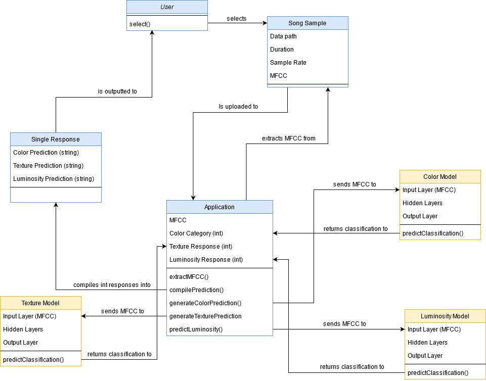
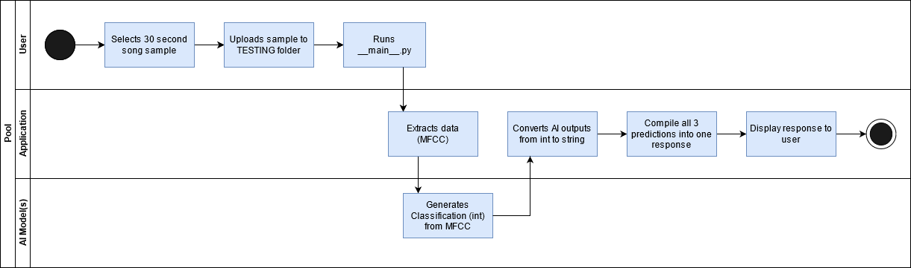

# Software Requirements Specification

|   |   |
| ----------- | ----------- |
| Version | 1.0 |
| Prepared By | Nikki Wood |
| Document Status | COMPLETE |
| Date Updated | 04/13/2021 | 

---

## Table of Contents
| **1.** | [**Introduction**](#1-introduction) |
| ------ | ---------------- |
| 1.1 | Purpose |
| 1.2 | Document Conventions |
| 1.3 | Intended Audience and Reading Suggestions |
| 1.4 | Product Scope | 
| 1.5 | References |
---
| **2.** | [**Overall Description**](#2-overall-description) |
| ------ | ---------------- |
| 2.1 | Product Perspective |
| 2.2 | Product Functions |
| 2.3 | User Classes and Characteristics |
| 2.4 | Operating Environment | 
| 2.5 | Design and Implementation Constraints |
| 2.6 | User Documentation |
| 2.7 | Assumptions and Dependencies |
---
| **3.** | [**External Interface Requirements**](#3-external-interface-requirements) |
| ------ | ---------------- |
| 3.1 | User Interfaces |
| 3.2 | Software Interfaces |
| 3.3 | Communications Interfaces |
---
| **4.** | [**System Features**](#4-system-features) |
| ------ | ---------------- |
| 4.1 | Data Extraction for Training |
| 4.2 | Training AI Model |
| 4.3 | Data Extraction for Single Sample Prediction |
| 4.4 | Generate Prediction for Single Sample |
| 4.5 | Swimlane Diagram of Functional Requirements |
---
| **5.** | [**Other Nonfunctional Requirements**](#5-other-nonfunctional-requirements) |
| ------ | ---------------- |
| 5.1 | Performance Requirements |
| 5.2 | Security Requirements |
| 5.3 | Software Quality Attributes |
| 5.4 | Business Rules | 

---

## Revision History
| Name | Date | Reason For Changes | Version |
| ---- | ---- | ------------------ | ------- |
| Initial Version (Draft) | 01/11/2021 | - | 0.1 |
| Mid-term Revision | 03/20/2021 | Adding Requirements | 0.2 |
| End of term Revision | 04/12/2021 | Adding more now that all other documentation is done | 0.3 |
| Finalize SRS | 04/13/2021 | Fix some formatting and finalize info | 0.4 |

## 1. Introduction

### 1.1  Purpose
This document is a representation of the Chromesthesia Response Replicator AI application. It describes how the user and software communicate to allow the user to view the sound-to-color synesthetic response of one individual. 

### 1.2  Document Conventions
Within this document:
- "Sample" or "song sample" will refer to an inputted song.
- "Category" (relating to "response") will refer to one of the three categories our subject is using to describe her synesthetic response. Categories include: Luminosity, Color, and Texture.
- "response" will refer to the combination of 'correct answers' for each category. For example, a response to a song might be "smoky black", "light soft purple", etc.
- "the AI" will refer to the part of this project that will identify patterns and assign a response to an inputted song sample. 
- "the Application" will refer to the part of this project that will take an inputted song, compile a response (from the AI), and output that response to the user.
- "Software" will refer to the project itself, including both the AI and the application.
- "synesthete" will refer to any individual with synesthesia
- "synesthetic response" will refer to the visuals seen by any synesthete with sound-to-color synesthesia (chromesthesia).
- "Subject", "Client", and "our synesthete" will refer to Meredith Turner, the synesthete that will be providing our training set. She will also be assisting with this project.

### 1.3  Intended Audience and Reading Suggestions.
This document is intended to be read by the Client, Nikki Wood, and Dr. Gary Cantrell. The Client should look for how this documentation represents how she intends the Software to function. Nikki Wood will use this document as she plans, builds, and tests the Software in order to fulfill the requirements and functions specified. Dr. Gary Cantrell will read and critique this document for errors and to give feedback.

### 1.4  Product Scope
This Software will give those who do not have chromesthesia a taste of what it might be like to have these sound-to-color conversions. It will also amplify our Subject's understanding of the correlation between her visual responses and the different genres, tempos, or timbre (sound/tone quality) in music.

### 1.5 References
TODO
---
## 2. Overall Description
### 2.1  Product Perspective
The Software will allow users to input a song into the Application. This Sample will be sent to the AI to create a response prediction. The Application will then deliver the response back to the user, so that they might see the visual interpretation of their song through the eyes of a synesthete. See Figure 2.1
<br/>
  
*Figure 2.1*

### 2.2  Product Functions
The Software will function as shown in Figure 2.2

  
*Figure 2.2*

### 2.3  User Classes and Characteristics
There exists only one class of User for this Software. This user class will be able to access all functions of the Software. 

### 2.4  Operating Environment

The operating environment of this software is through Windows Explorer (moving test sample into the test folder) and through the command line (running script and generating prediction).

### 2.5  Design and Implementation Constraints
The Software must be able to access the three model files, but should be able to be ran on any computer with Python installed. 

### 2.6  User Documentation 
To test a sample:
- Be sure that the sample is 30 seconds in length
- Move the sample into the \src\test_samples\TESTING folder. 
- Note: If there is more than one sample in this folder, only the first (alphabetical order) will be analyzed. 
- Run the main.py file by using the following command:
  ```
    python -m src
  ```
- If you would like to use a different location, you can specify the path of the testing folder using -p or --path
- Again, make sure there is only one sample in the folder
  ```
    python -m src -p C:\Users\user\Downloads\mytest
  ```
- To view other commands, use --help.
  ```
  python -m src --help
  ```

### 2.7  Assumptions and Dependencies
|   |   |
| - | - |
| AS1 | User will only test one song sample at a time. | 
| AS2 | User will either use the provided TESTING folder, or will provide their own folder with one sample contained in it. |
| DE1 | User will already have Python installed and added to path on the host machine. |
| DE2 | User will have access to 30 second samples | 

---
## 3. External Interface Requirements
### 3.1  User Interfaces
The User will interface with Window Explorer (or other folder navigation system) to move their sample into the correct folder. They will then use the command line to run the script and receive a prediction.

### 3.2  Software Interfaces
This Software will use pre-saved models, included in the src\models folder. 

### 3.3  Communications Interfaces
This Software will output the prediction via command line.

---

## 4. System Features

### 4.1 Data Extraction for Training
#### 4.1.1 Description/Priority
    Extract MFCCs and labels for all testing/training data.
    High Priority. Application will not be able to classify song labels without the MFCC and correct label.

#### 4.1.2 Stimulus/Response Sequence
    Stimulus: User provides a path to all song samples, sorted into folders named with the correct category.
    Response: System extracts MFCCs and labels for each song and saves them in a .json file. Status is outputted to user.

#### 4.1.3 Functional Requirement
|   |   |
| --- | --- |
| FR 4.1.3.1 | Software must be able to extract a dynamic (changing) number of categories. | 
| FR 4.1.3.2 | Software must be able to extract a dynamic (changing) number of samples from each category. | 
| FR 4.1.3.3 | Software must output a .json file that can be parsed into the mapping (category), mfcc (input), and label (output)

### 4.2  Training AI Model
#### 4.2.1  Description/Priority
    Classify Color/Texture/Luminosity for all testing/training data.
    High Priority. Application will not be able to predict a synesthetic response without this component.

#### 4.2.2 Stimulus/Response Sequence
    Stimulus: User provides a path to training data.
    Response: System trains and saves the model, outputting the accuracy.

#### 4.2.3 Functional Requirements
|   |   |
| --- | --- |
| FR 4.2.3.1 | Software must output an accuracy percentage for each epoch. | 
| FR 4.2.3.2 | Software must output an Accuracy Evaluation (graphical representation of accuracy over numer of epochs)| 
| FR 4.2.3.3 | Software must output a correctly labeled confusion matrix |

### 4.3 Data Extraction for Single Sample Prediction
#### 4.3.1  Description/Priority
    Extract MFCC for single sample of 30 second length.
    High Priority. Application will need to extract the MFCC in order to get a prediction from the saved models.

#### 4.3.2 Stimulus/Response Sequence
    Stimulus: User provides a 30 second sample in the TESTING folder
    Response: System extracts MFCC and stores it to be classified. 

#### 4.3.3 Functional Requirements
|   |   |
| - | - |
| FR 4.3.3.1 | Software must save MFCC for all three model inputs. | 

### 4.4 Generate Prediction for Single Sample
#### 4.4.1 Description/Priority
    Send sample MFCC to all 3 models, convert the returned integer into a classification string. 
    High Priority. This is the final output and overall goal of the program.
    
#### 4.4.2 Stimulus/Response Sequence
    Stimulus: MFCC has been extracted from the user's provided sample.
    Response: System collects and compiles and outputs the models' predictions into a user-friendly description.

#### 4.4.3 Functional Requirements
|   |   |
| - | - |
| FR 4.4.3.1 | Software must save each model's output. | 
| FR 4.2.3.2 | Software must convert each model's output into a string representation of the corresponding category classification. | 
| FR 4.2.3.3 | Software must output all three predictions (as strings) to the command line in a way that is readable to the user. |

### 4.5 Variety of Music For Testing
#### 4.5.1 Description/Priority
  Models should be trained on a wide variety of testing to get the most accurate results. 
  Mid Priority. The product will still work with a small genre sample. However, it will not be as accurate.

#### 4.5.2 Functional Requirements
|   |   |
| - | - |
| FR 4.5.2.1 | Software must be trained on at least 20 genres. | 

### 4.6 Sufficient Representation for All Categories
#### 4.6.1 Description/Priority
  Each category will have a minimum of 15 songs each. Cattegories include Red, Orange, Yellow, ... (for Color), Smoky, Woody, Sparkly, ... (for Texture), Yes, No (for Luminosity).
  High Priority. Without sufficient representation, some colors may never be guessed.

#### 4.6.2 Functional Requirements
|   |   |
| - | - |
| FR 4.6.2.1 | Cattegories must each have at least 15 songs. | 
---

### 4.5 Swimlane Diagram of Functional Requirements

  
*Figure 4.5 | Swimlane diagram for uploading sample and receiving synesthetic prediction.*

## 5. Other Nonfunctional Requirements

### 5.1 Performance Requirements
The overall speed of the Software will depend on the hardware it is run on. Must run prediction in a reasonable amount of time (under 30 seconds).
Training will depend most on the hardware, but will take much longer (10-30 minutes).

### 5.2 Security Requirements
There is no authentication process. 

### 5.3 Software Quality Attributes
Software can be run from any computer, as long as it has the main.py script and .h5 model files. 

### 5.4 Business Rule
This Software is to be used by the Client, Developer, and anyone who is curious about synesthesia. 

### 5.5 Accuracy Score Minimum
This Software must accomplish an accuracy score of 50% to be considered successful (primary goal).