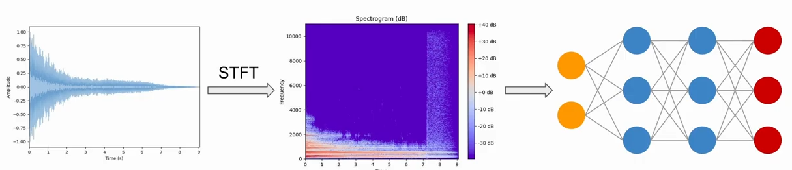

# Project Evaluation

## Customer satisfaction analysis

Conduct a customer satisfaction analysis and report/reflect on the results.

> "based on client feedback forms.."

---

## Objective Reflections
### Primary

| # | Objective | Reflection | 
| - | --------- | ---------- |
| 1. | Reflect on the goal of finding the expected outcome for each category with 50% accuracy. | Color, Texture, and Luminosity models successfully met the primary 50% accuracy goal. Refer to **Accuracy Reflection** [page](https://github.com/woodenikki/SynesthesIA/blob/main/Documentation/6.%20Accuracy%20Reflection.md). |
| 2. | Application compiles each expected outcome and returns the ‘correct answer’ as one response (command line) | [Response] |
| 3. | Minimum of 12 hours of research (Neural nets, similar AI projects, python application with AI, etc.) | Completed. Time spent on Research(ML/DL) was [time]. Time spent on Research(Synesthesia) was [time]. Refer to **Time Report** on page [page]. |
| 4. | Find at least 15 samples for each category. | Completed. Refer to **Data and Responses** on page [page]. |
| 5. | Reflect on the expansion of my knowledge and comprehension of AI, Deep Learning, and Neural Nets. | Completed. Refer to **Reflection of Knowledge Expansion** |
| 6. | Keep detailed documentation throuighout the process. | Completed. Refer to the **Software Requirements Specifications**. |

### Secondary
| # | Objective | Reflection | 
| - | --------- | ---------- |
| 1. | Reflect on the goal of finding the expected outcome for each category with 70% accuracy. | Color, Texture, and Luminosity models did not meet the secondary 70% accuracy goal. |
| 2. | GUI to choose a song & get display result (color) | I did not create a GUI to upload songs and display the resulting Color response |
| 3. | Synesthesia literary review | Complete. Refer to the **Synesthesia Literary Review** on page [page]. |

### Tertiary
| # | Objective | Reflection | 
| - | --------- | ---------- |
| 1. | Reflect on the goal of finding the expected outcome for each category with 90% accuracy. | Color, Texture, and Luminosity models did not meet the tertiary 90% accuracy goal. | 
| 2. | Analysis of results and how they can relate to Synesthesia | ***INCOMPLETE*** | 
| 3. | GUI displays resulting color with luminosity and texture. | I did not create a GUI to upload songs and display the resulting Color + Texture + Luminosity response. |
| 4. | Publication of results | Incomplete; I did not submit a paper for publication |

---

## Evaluate User Stories

| # | User Story Title | User Story Description | Status | Notes |
| --- | --- | --- | --- | --- |
| 1 | Show Prediction | As a user, I want to see know the Color, Luminosity, and Texture of the predicted synesthetic response | COMPLETE |  Response from the terminal in the form of a sentence: "Song is predicted to be Woody Orange with no luminosity." |
| 2 | Visual Prediction | As a user, I want to see a visual representation of what the AI has predicted | INCOMPLETE | (Secondary Goal) Did not generate an image.|
| 3 | Select a Song | As a user, I want to select a song to view the synesthetic response for | COMPLETE | User can determine synesthetic response by dragging the sample into the TESTING folder. |
| 4 | Upload a song | As a user, I want to be able to upload my own song sample to see the AI's prediction | COMPLETE | Has to be a 30 second sample. | 
| 5 | Sort by Color | As a user, I would like to sort the database of trained songs, so that I can look for similarities in the songs. | COMPLETE? | Trained songs can be sorted in excel to see the corelation between color, texture, genre, etc. |

---

## Reflect on the expansion of my knowledge and comprehension of AI, Deep Learning, and Neural Nets

Before working on this project, I had some basic understanding of AI. However, my understanding of machine learning, deep learning, and neural networks was pretty slim. I knew that if I wanted to accomplish the goal of this project, I would need to do quite a bit of research about what these three subjects were and how they are all connected. 

I didn't want to start coding without having a solid understanding of the tools I would be using. First, I learned that AI is the more broad topic of building agents to achieve a goal. Machine learning is a subset of AI, and deep learning is a subset of machine learning that uses deep neural networks. Next, I learned how to implement an artifical neuron from scratch in python.

I continued looking into the math behind neural networks-- specifically, how vector and matrix operations made them work. Then, I learned about the different layers of neural networks and the functions that they serve. Finally, I dug into how audio samples are analyzed and used in the scope of artificial intelligence. Understanding how audio data can be used in deep learning was integral to the success of my project, so I made sure to spend the time doing so. 

In order to prepare an audio file for deep learning, the MFCC (Mel Frequency Cepstral Coefficients) must be extracted. The MFCC captures textural and timbral aspects of sound (the feeling and quality of music you can decipher from using different instruments). Because of this, MFCCs allow artificial intelligence to imitate the human auditory system. First, a regular fourier transform breaks a complex sound wave into the sum of sine waves oscillating at different frequencies. A short time fourier transform (STFT) computes several fourier transforms at different time intervals. This means that an STFT can convert a sound wave into a spectogram (time + frequency + magnitude). A discrete cosine transform (DCT) is performed on the spectogram to give us the MFCC, which can be interpreted by the neural network for applications like speech recognition, music genre classification, instrument classification, and projects like this one.

  
> Image, AI/DL/NN lectures, practice guides courtesy of [Valerio Velardo- The Sound of AI](https://www.youtube.com/channel/UCZPFjMe1uRSirmSpznqvJfQ)

Throughout this process, I did a few small examples of simple neural networks, audio preperation for deep learning, etc. These can be found in the Neural Net and Deep Learning Practice section on page [page]. 

---

## Explain how you would have done it differently given another chance

The most problematic part of this project was finding a complete dataset; I ended up using 15 samples to represent each category, which was definitely not large enough. Using such a small sample size guarantees to have an overfit model. 

Because all of the data must come from one person, it can be time consuming and difficult to get the data in the first place. It is also difficult to guarantee an equal number of samples for each category. In this example, Pink songs were extremely rare, while Blue songs dominated the dataset. Because the AI did not work when categories were not equally represented, I had to throw out 54% of my data for the Color model. In order to get the most out of all the data collected, a great deal of time would need to be spent searching out songs of specific colors. In the case of the Color category, 289 songs would need to be found to equal out the dataset without throwing any songs away. 

My client gave me an estimation of two hours to find 20 songs of one color. She also mentioned that it would be likely that all songs would be of the same genre, since it is easy to find songs that sound similar to each other. Because I made it a priority of finding a range of genres, I would either have to sacrifice the even distribution of genres, the time spent to find new songs, or the number of samples for each category. 

If I were to do the project again, I would have spent more time looking for a more-complete database of songs to use. I found one with a few genres, but I ended up doing all the song searching and cutting myself, which ended up being the most tedious part of my project. This would have freed up time, which could have been used to even out the category samples. 
