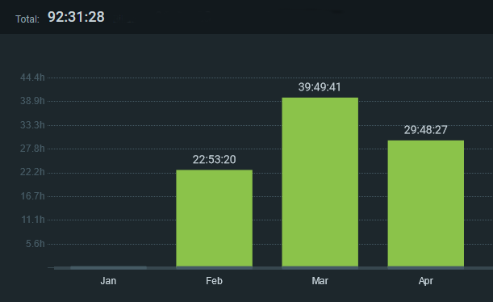
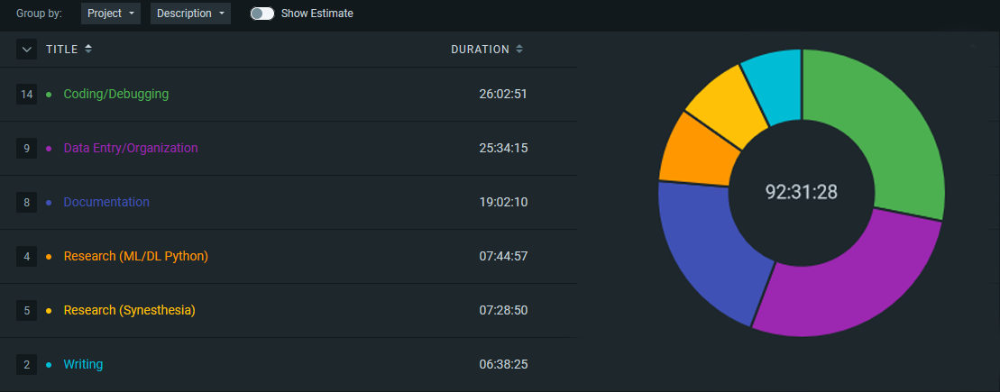

# Time Report

This project took me a total of [time]. I tracked my progress using Clockify, an online time tracker that allows me to write down what I was working on and what 'project' it was for. I classified my work into 6 categories. 

- **Coding/Debugging**: Coding, debugging, training, testing, etc. 
- **Data Entry/Organization**: Gathering, sorting, and cutting song samples for the AI.
- **Documentation**: Writing/editing this project's documentation.
- **Research (ML/DL Python)**: Researching deep learning, artificial intelligence, neural networks, and how they work in python.
- **Research (Synesthesia)**: Researching synesthesia, how it works and occurs, etc.
- **Writing**: Writing my literary review and final presentation.

## Monthly Summary
  

## Project Summary
  

## Evaluation

Coding/Debugging was the largest category. I was surprised at how short my training time was compared to what I planned for, but I still ended up dedicating most of my time to code. 

Regrettably, Data Entry/Organization was close 2nd. Before discovering that the number of samples representing each category had to be the same, I spent a lot of time testing different datasets on my model, which is time consuming. Also, because I couldn't find a database that had a wide enough genre spread to match my goals, I had to find and cut each of the 305 songs into three 30-second samples (total of 915 samples). This was definitely the most tedious and time consuming part of my project. 

My Documentation time was *way* more than I originally planned. However, having to comb through my previous documentation and Software Engineering notes has made that knowledge stronger. I have a much better understanding of how to keep well-written documentation and why it is important. I also got to practice my Markdown skills, which I have been looking for an opportunity to do!

One of my primary goals was to spend at least 12 hours on research; I ended up dedicating **7:44:57** to ML/DL/NN (Machine learning, deep learning, neural networks), and **7:24:50** to Synesthesia. I feel like this was a sufficient time for both categories. This gave me a total of **15:13:47** spent on research.

Over-all, I am happy with where my time was spent.